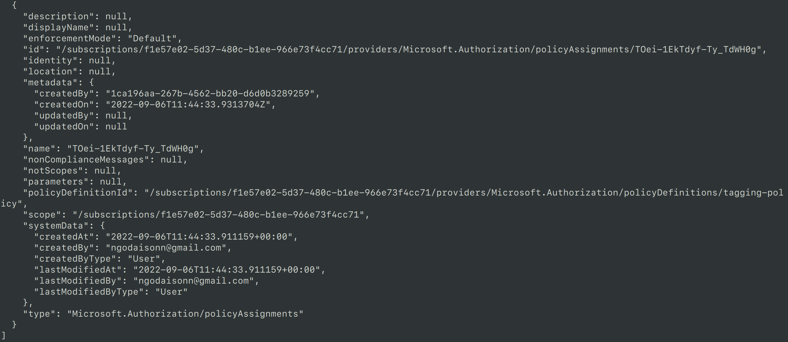

# Azure Infrastructure Operations Project: Deploying a scalable IaaS web server in Azure

### Introduction
For this project, you will write a Packer template and a Terraform template to deploy a customizable, scalable web server in Azure.

### Getting Started
1. Clone this repository

2. Create your infrastructure as code

3. Update this README to reflect how someone would use your code.

### Dependencies
1. Create an [Azure Account](https://portal.azure.com) 
2. Install the [Azure command line interface](https://docs.microsoft.com/en-us/cli/azure/install-azure-cli?view=azure-cli-latest)
3. Install [Packer](https://www.packer.io/downloads)
4. Install [Terraform](https://www.terraform.io/downloads.html)

### Instructions

1. Build image with packer
``` bash
# create new resource group to store the image 
az group create -n udacity-azuredevops

# build image
packer build -var=file=server.var.json sever.json
```

2. Deploy infrastructure to azure 
``` bash
terraform apply -auto-approve
```

3. Change number of minimun number of instances
``` bash 
terraform apply -var minimun_instance=<new_number>
```

### Output
1. Policy


2. Terraform apply


3. web


4. URL  
http://13.76.25.84/
